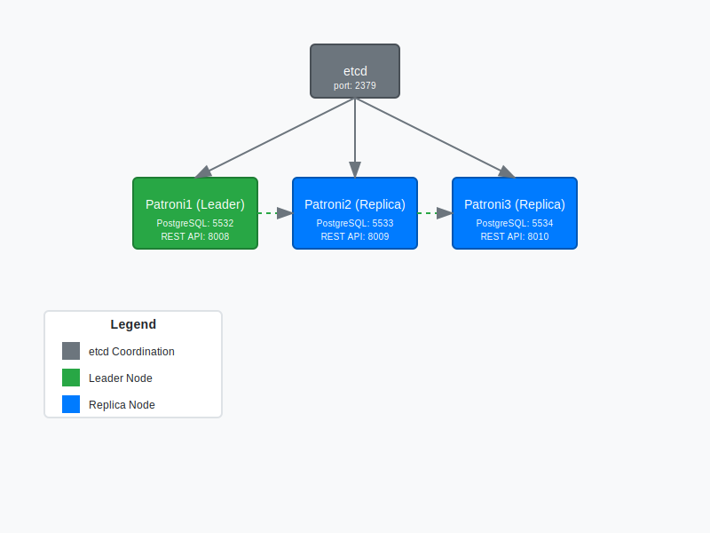

# PostgreSQL High Availability Cluster with Patroni

A comprehensive PostgreSQL high-availability solution using Patroni for automatic failover, with etcd for cluster coordination. This setup provides robust high availability with automatic failover capabilities.

## Architecture Diagram


## Features

- Automatic failover with Patroni
- Distributed consensus with etcd
- REST API for cluster management
- Dynamic configuration updates
- Zero-downtime failover
- Multi-node architecture

## Architecture Overview

- 3 PostgreSQL nodes managed by Patroni
- etcd for cluster coordination and leader election
- Automatic failover capability
- REST API for cluster management

## Components
### etcd

- Distributed key-value store
- Handles cluster coordination
- Stores cluster state and configuration
- Port: 2379

### Patroni Nodes
#### Node 1 (patroni1)
- Port: 5532 (PostgreSQL)
- Port: 8008 (REST API)
- Primary node with failover capability

#### Node 2 (patroni2)
- Port: 5533 (PostgreSQL)
- Port: 8009 (REST API)
- Replica with failover capability

#### Node 3 (patroni3)
- Port: 5534 (PostgreSQL)
- Port: 8010 (REST API)
- Replica with failover capability

## Failover Process

1. **Health Monitoring**
   - Patroni continuously monitors node health
   - Checks PostgreSQL process status
   - Monitors replication lag

2. **Leader Election**
   - When master fails, Patroni initiates leader election
   - Uses etcd for distributed consensus
   - Ensures only one node becomes master

3. **Promotion Process**
   - Selected replica is promoted to master
   - Other replicas are reconfigured to follow new master
   - Cluster continues operation with minimal downtime

## Key Features

1. **Automatic Failover**
   - No manual intervention needed
   - Typically completes within seconds
   - Prevents extended downtime

2. **Consistent Leadership**
   - etcd ensures single master
   - Prevents split-brain scenarios
   - Maintains data consistency

3. **REST API**
   - Monitor cluster health
   - Check node status
   - Trigger manual failover if needed

## Usage

1. Start the cluster:
   ```bash
   docker-compose up -d
   ```

2. Check cluster status:
   ```bash
   curl -s http://localhost:8008/cluster | jq .
   ```

3. Monitor node status:
   ```bash
   curl -s http://localhost:8008/patroni | jq .
   ```

## Testing Failover

1. Identify current master:
   ```bash
   curl -s http://localhost:8008/cluster | jq -r '.members[] | select(.role=="leader") | .name'
   ```

2. Simulate failure by stopping master:
   ```bash
   docker stop <master_container_name>
   ```

3. Observe automatic failover:
   ```bash
   curl -s http://localhost:8008/cluster | jq .
   ```

## Best Practices

1. **Monitor Cluster Health**
   - Regularly check node status
   - Monitor replication lag
   - Watch for warning signs

2. **Backup Strategy**
   - Maintain regular backups
   - Test recovery procedures
   - Document backup process

3. **Network Configuration**
   - Use reliable network
   - Configure appropriate timeouts
   - Monitor network latency

## Limitations

1. **Split-Brain Prevention**
   - Requires majority of nodes
   - Minimum 3 nodes recommended
   - Network partition handling

2. **Resource Requirements**
   - Additional overhead from Patroni
   - etcd cluster maintenance
   - Higher system requirements

## Security Considerations

1. **Authentication**
   - Secure superuser credentials
   - Protect replication credentials
   - Restrict REST API access

2. **Network Security**
   - Use internal networks
   - Configure firewalls
   - Enable SSL/TLS

## Troubleshooting

1. **Check Logs**
   ```bash
   docker logs patroni1
   ```

2. **Verify Connectivity**
   ```bash
   curl -s http://localhost:8008/health
   ```

3. **Monitor Replication**
   ```bash
   psql -h localhost -p 5532 -U myuser -d mydb -c "SELECT * FROM pg_stat_replication;"